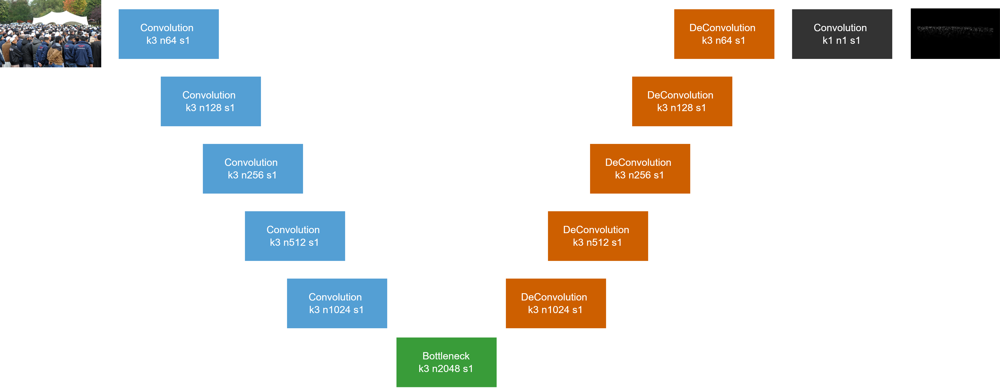

# Density Map based Crowd Counting using a simple U-Net Architecture

This project implements a crowd-counting approach that reconstructs density maps of people in images using a U-Net-based architecture.

The main goal is to provide a reliable baseline for crowd counting while exploring the effect of dataset selection and preprocessing strategies on model performance.

---

## Density Maps

Density maps are continuous representations of crowd distributions in an image. Each pixel encodes the estimated density of people in that local region. By summing over all pixel values, the total crowd count can be estimated. They are commonly used in crowd-counting tasks because they allow the model to focus on local variations in crowd density rather than predicting a single global count.

## Model Architecture

The model is based on a U-Net architecture. It is designed for image-to-image regression, where the input is an image of a crowd and the output is a corresponding density map which can be aggregated into an estimated count of people.

  

---

## Preprocessing & Training

Training was performed using annotated images with density maps generated via an adaptive Gaussian kernel, which accounts for perspective distortion and serves as ground truth for supervised learning.

However the high resolution input images presented GPU memory challenges, causing either training crashes or excessively long training times.  

**Solution:** Images were split into overlapping patches, which:

- Reduced memory usage  
- Shortened training time by approximately 3x  
- Preserved all relevant image information  

Preliminary experiments confirmed the model and preprocessing pipeline function correctly for high-resolution inputs.

---

## Visual Comparison

Below is an example of a qualitative comparison between the input image, the predicted density map, and the ground truth density map.

  <figure style="display: inline-block; margin: 10px; text-align: center;">
    
    <figcaption>Input Image</figcaption>
  </figure>

  <figure style="display: inline-block; margin: 10px; text-align: center;">
    
    <figcaption>Predicted Density Map</figcaption>
  </figure>

  <figure style="display: inline-block; margin: 10px; text-align: center;">
    
    <figcaption>Ground Truth Density Map</figcaption>
  </figure>

The model captures crowd distributions well, although high-frequency regions can occasionally be misestimated.

---

## Quantitative Results

Evaluation was performed using standard crowd-counting metrics. The choice of dataset had a major influence on performance:

| Model | Year | Mean Absolute Error | Mean Squared Error |
|-------|------|---------------------|--------------------|
| MCNN [9]| 2016 | 277.0 | 426.0 |
| Cascaded-MTL [18] | 2017 | 251.9 | 513.9 |
| CSRNet [20] | 2018 | 120.3 | 208.5 |
| HA-CNN [7] | 2019 | 118.1 | 180.4 |
| IA-DCCN [24] | 2019 | 125.3 | 185.7 |
| PCC Net [25] | 2020 | 246.4 | 247.1 |
| ASNet [26] | 2020 | 91.6 | 159.7 |
| DFN [27] | 2021 | 218.2 | 357.4 |
| PFC [10] | 2021 | 84.3 | 141.2 |
| CFA-Net [12] | 2021 | 89.0 | 152.3 |
| Lw-Count [8] | 2022 | 149.7 | 238.4 |
| DMCNet [5] | 2023 | 96.5 | 164.2 |
| Gramformer [6] | 2024 | 76.7 | 129.5 |
| **This Model** | 2025 | 154.9 | 260.7 |

Older models like MCNN and Cascaded-MTL show relatively high MAE and MSE, reflecting limitations in early architectures. 
Compared to more complex models with attention mechanisms (e.g., CFANet [12], DMCNet [5], Gramformer [6]), this simple U-Net shows larger average deviations (up to ~49.5%) due to errors in high-frequency regions and serves as a baseline for further improvements.

---

## Limitations

- Model size (~1.5 GB) is relatively large  
- Requires fully annotated data -> only supervised training is possible  
- High variability in combined datasets reduces robustness
- Does not achieve state-of-the-art performance  
  
---

## Future Work

Potential extensions include:

- Adding attention mechanisms for better localization  
- Exploring lightweight models for faster inference  
- Semi-supervised training with partially annotated data  
- Alternative loss functions for improved performance  
- Video-based crowd counting for temporal consistency

---

## Structure

The repository contains:

